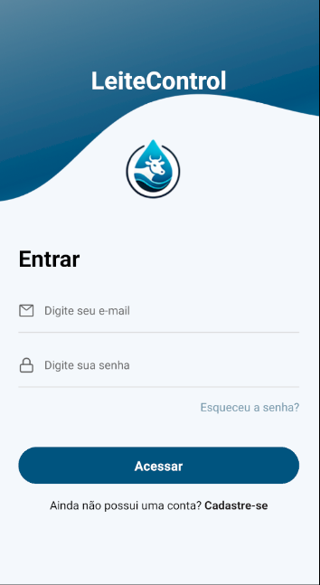
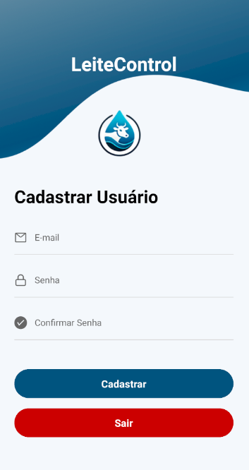
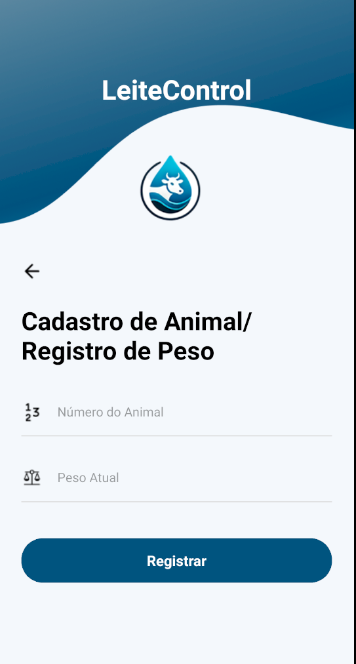
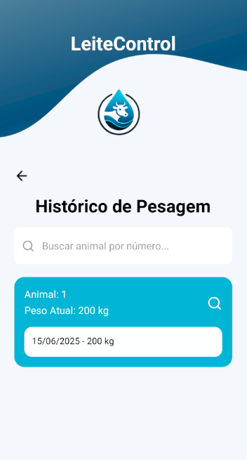
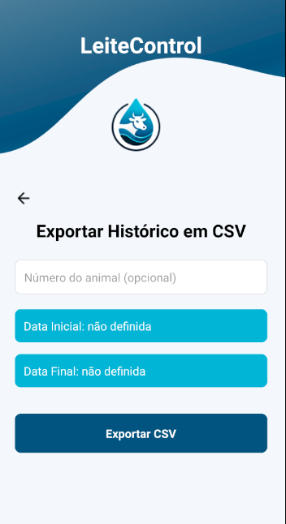
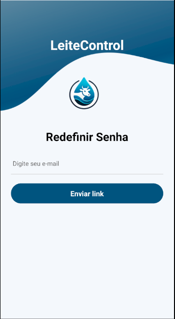
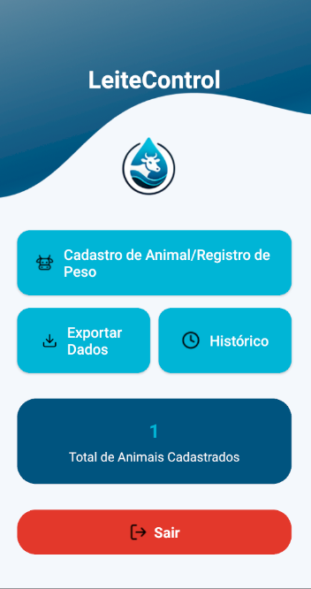
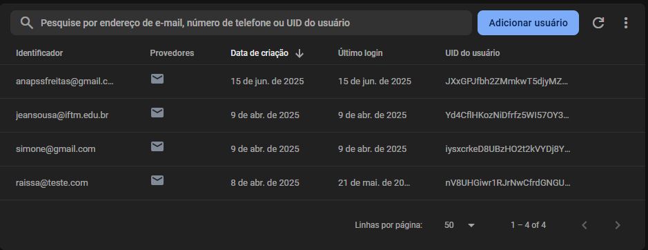
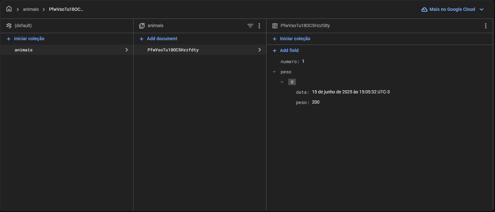

# 🐄 LeiteControl - App de Controle de Pesagem de Gado Leiteiro

Bem-vindo ao **LeiteControl**, um aplicativo mobile desenvolvido para auxiliar pequenos e médios produtores na **gestão de peso do gado leiteiro**, de forma simples, prática e digital.

---

## 📱 Funcionalidades

- 📥 Cadastro de animais
- ⚖️ Registro de peso diário (com verificação para evitar duplicatas)
- 📊 Histórico de pesagens
- 🔐 Autenticação de usuários (Firebase Auth)
- 🔄 Redefinição de senha por e-mail
- 💾 Exportação de dados (CSV)
- 👨‍🌾 Interface intuitiva para usuários com pouca familiaridade com tecnologia

---

## 🚀 Tecnologias Utilizadas

- [React Native + Expo](https://expo.dev/) – Interface mobile multiplataforma
- [Firebase Authentication](https://firebase.google.com/products/auth) – Autenticação de usuários
- [Firebase Firestore](https://firebase.google.com/products/firestore) – Banco de dados em nuvem
- [React Navigation](https://reactnavigation.org/) – Navegação entre telas
- [JavaScript ES6+](https://developer.mozilla.org/pt-BR/docs/Web/JavaScript) – Lógica de programação

---
## 📷 Prints do App

| Login | Cadastro de Usuário |
|-------|---------------------|
|  |  |

| Registro de Peso | Histórico de Pesagens |
|------------------|------------------------|
|  |  |

| Exportação CSV | Redefinir Senha |
|----------------|------------------|
|  |  |

| Menu Principal | Firebase - Usuários |
|----------------|----------------------|
|  |  |

| Firebase - Coleção `animais` |
|-------------------------------|
|  |

---

👩‍💻 Desenvolvido por
Ana Paula Santos de Freitas
Curso de Análise e Desenvolvimento de Sistemas
Instituto Federal do Triângulo Mineiro - Campus Patrocínio
Orientação: Prof. Júnio Moreira

